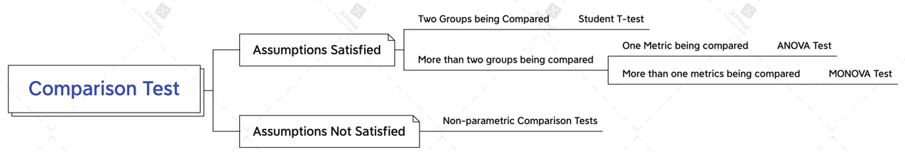
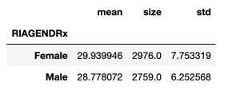
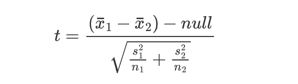
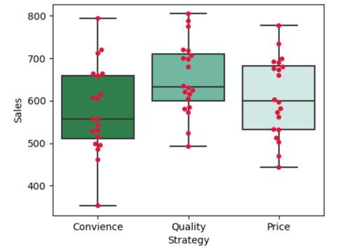

## Hypothesis Testing

In the passage, I will summarize knowledge about hypothesis testing and
learning notes of books, such as *Trustworthy Online Controlled Experiment*.
The main topics include:
- What is hypothesis testing
- How to conduct hypothesis testing
- Primary statistical tests
- What is wrong with multiple hypothesis tests?


### What is Hypothesis Testing?
Hypothesis testing is a kind of inferential statistics in which an analyst
assesses the plausibility of hypothesis by using sample data.

###  How hypothesis testing works?

In hypothesis testing, analysts randomly select samples from population and use
statistical tests to examine the plausibility of the null hypothesis and 
alternative hypothesis. The type of statistical test depends on the business
objective of our task. For example, we may use t-test to examine the plausibility
of hypothesis if our goal is to identify whether there is a treatment effect
between treatment group and control group. Or we may use chi-square test
to confirm the independence of two metrics/variables if we aim at confirming
the association between the two objects. 

When doing hypothesis test, we usually assume the equality
between population parameters. For example, we may assume that the *user
engagement* will be the same even if we launch a new feature into our product;
the alternative hypothesis will be the user engagement is different from before.

### How to conduct hypothesis testing?
There are four primary steps to implementing hypothesis test:
- State null hypothesis and alternative hypothesis on the condition of 
business objective
- Formulate an analysis plan, outlining how to evaluate the sample data.
what statistical test we will use
- Examine the assumptions of hypothesis test and carry out the plan to 
analyze the data 
- Make decision based on the p-value of tests, either accepting or rejecting
null hypothesis.


**Example of Hypothesis Testing**

91 out of 247 (36.8%) sampled parents of black children report that their 
child has had some swimming lessons. 120 out of 308 (38.9%) sampled parents 
of Hispanic children report that their child has had some swimming lessons. 
Is there a significant difference between the population proportions of parents of black children and parents of Hispanic children who report that their child has had some swimming lessons?

Population: parents with children

Parameter of Interest: the difference in population proportions of parents(Hispanic/Black)

*Step 1: State hypothesis*
- Null Hypothesis: the population proportion of parents with hispanic children
who had swimming lessons is not significantly different from that of parents with black children.
- Alternative Hypothesis: the population proportion of hispanic parents with children taking swimming lessons is 
significantly different from that of black parents with children taking swimming lessons.

*Step 2: Formulate analysis plan*

Since the objective is to test whether there is a significant difference 
in population proportions, we need to a kind of statistical test that compares
the proportion of the two groups. T-tets is a good choice here, but we need to 
check the assumptions of t-test.

*Step 3: Check assumptions*
Assumptions:
- The data are collected from representative, randomly selected portion of 
the total population.  
- The sample data should follow normal distribution.
- Homogeneity. The two sample data have the approximately equal variance.
- The two samples should have enough sample size.
```Python
# calculate the sample variance for the two groups
p1 = round(91/247,3)
p2 = round(120/308,3)
var_black = p1*(1-p1)
var_hispanic = p2*(1-p2)
print(var_black,var_hispanic)
```
`0.232576, 0.2379`
The two variances are highly similar, indicating that the groups have
approximately equal variance. Also the two sample sizes, 247 and 308, allow
us to rely on central limit theorem to state that the two samples have
normal distribution. Let's move onto the analysis seciton.

*Step 4: calculate test statistics and make decisions based on p-value*

test-statistics: 

```Python
import numpy as np
from scipy import stats
# calculate test statistics
phat = (91+120)/(247+308)
phat_var = phat*(1-phat)
t_test = (p1-p2)/np.sqrt(phat_var*(1/247+1/308))
# calculate p-val
pval = 2*scipy.stats.norm(0,1).cdf(t_test)
print(pval)
```
`0.6093128715165157`
We need to accept the null hypothesis because p value is greater than 0.05.
So the population proportion of hispanic parents with children who had swimming
lessons is approximately the same as that of black parents with children who
had swimming lessons.


### Primary Comparison Tests
To determine the statistical test that we will use, we should consider
the prerequisite assumptions and number of groups being compared:
- Assumptions:
  - **Independece of observations:** the observations/variables included in our test
  are not correlated with each other. For example, multiple measurements of the same experiment
  subject are not independent, such as longitudinal studies. But measurements of
  different experiment subjects are independent.
  - **Normality.** Data should follow normal distribution. 
  - **Homogeneity of variance.** the variance within each group being compared
  is similar.
- Number of Groups being compared
- Number of metrics being compared
  

#### T-Test

T-test is a kind of parametric inferential statistical method used to compare the means
between two groups(two-sample t-test) or the sample mean with the specified value(one-sample t-test).
If a dataset follows a normal distribution with known population mean but unknown 
variance, t-test should be used. 

**Takeaways of T-test:**
- T-test is a parametric statistical test, meaning that it makes explicit assumptions
about the dataset.
- In T-test, test statistic follows a t-distribution under the null hypothesis.
- Compared with Z-test, which is appropraite for large sample, t-test can be used in
small dataset(n<=30).
- T-tets has different types based on the number of samples
  - One sample t-test compares the sample mean with the hypothesized value
  - Two sample t-tets compares the means of two independent groups.
  - Paired t-test compares the difference between the pair of dependent variables.

##### One Sample T-test
One sample t-tets compares the sample mean with the hypothesized value. For example,

One sample t-test formula:

The statistic tries to measure the how far away the sample statistic is from
the hypothesized value in terms of standard errors. The further away our sample statistic is, the less confident we will 
be in our null hypothesized value.

**Lab of one sample t-test**

In previous years 52% of parents believed that electronics and social media was the cause of their teenager’s lack of sleep. Do more parents today believe that their teenager’s lack of sleep is caused due to electronics and social media?
Now we randomly sampled 1018 parents from population, and 56% of parents believe that teenager's lack of sleep is caused by electronics and social media.

- Null: p = 0.52
- Alternative: p != 0.52
```Python
import pandas as pd
import numpy as np
from scipy import stats
import statsmodels.api as sm

# calculate the t statistics
n = 1018
p = 0.56
pnull = 0.52
se = np.sqrt(p*(1-P)/n)
tstat = (p-pnull)/se

# calculate p value
pval = 1-stats.norm(0,1).cdf(tstat) # one-sided test
print(pval)
```
Alternative method is to directly apply proportions_ztest
```Python
zstat,pval = sm.stats.proportions_ztest(phat*n,n,pnull,alternative="larger")
print(pval)
```
0.005316510991822442. Based on the pvalue, We have sufficient evidence against
the null hypothesis. The proportion should be larger than 0.52 today.

##### Two Sample T-Test

Two sample t-test compares the means of two independent groups. For example, we launch
a new feature into product and want to examine the feature's impact on revenue. After
collecting data and randomly selecting samples from population into treatment and control,
we can compare the means of two groups to confirm the research effect.

**Lab of Two Sample T-test**

Considering adults in the NHANES data, do males have a significantly higher 
Body Mass Index than females?
```Python
# first we calculate the point estimate for the difference of BMI
filepath = "../data/nhanes_2015_2016.csv"
df = pd.read_csv(filepath)

df["RIAGENDRx"] = df["RIAGENDR"].replace({1:"Male",2:"Female"})
res = df.groupby("RIAGENDRx").agg({"BMXBMI":[np.mean,np.size,np.std]})
res.columns = ["mean",'size','std']
res
```


Here, the equal variance assumption is violated, so I will use the unpooled
approach to calculate the test statistic.

```Python
dif = res.loc["Female","mean"] - res.loc["Male","mean"]-0
var1 = res.loc["Female","std"]**2
var2 = res.loc["Male","std"]**2
n1 = res.loc["Female","size"]
n2 = res.loc["Male","size"]
# calculate tstat and pval
tstat = dif/np.sqrt(var1/n1+var2/n2)
pval = stats.t(n1+n2-1).cdf(tstat)
print(pval)
>0.9999999998027931
```
Alternative method is to use `ttest_ind`
```Python
import statsmodels.api as sm
tstat,pval,df = sm.stats.ttest_ind(mdata["BMXBMI"],fdata["BMXBMI"],alternative="larger",usevar="unequal")
print(tstat,pval,df)
>-2.608814433503646 0.995060976960757 173.60922650001183

# scipy package
tstat,pval = stats.ttest_ind(mdata["BMXBMI"],fdata["BMXBMI"],alternative="greater",equal_var=False)
print(tstat,pval)
>2.608814433503642,0.995060976960757
```
Based on the p value, we should accept the null hypothesis, indicating that
the BMI of males do not have significantly higher BMI than females.


##### Paired t-test

Paired t-test is used to compare the difference between dependent variables
for the same subject. For example, a measurement of patients is taken before
and after experiment.

- Null Hypothesis: there is no significant difference between the two dependent
variables
- Alternative Hypothesis: there is a significant difference between the two dependent variables.

**Assumptions:**
- Differences between the two dependent variables follows a normal distribution
- Differences between the two dependent variables should not have outliers
- Observations are randomly selected from the same population

For paired t-tets statistics, the formula is the same as one sample t-test:


**Example of Paired t-test**

An instructor wants to use two exams in he classes
next year:This year, she gives both exams to the students. She
wants to know if the exams are equally difficult and wants to check
this by looking at the difference between scores. If the mean difference
is close to zero, she will make a conclusion that the exams are equally difficult.

Based on the information, we can state the following hypothesis:

- Null: the two exams are equally difficult
- Alternative: the mean difference of two exams is statistically different

```Python
import pandas as pd
import numpy as np
# prepare the data
student = ["Bob","Nina","Tim","Kate","Alonzo","Jose","Nikhil","Julia","Tohru","Michael","Jean","Indra",
          "Susan","Allen","Paul","Edwina"]
exam_score1 = [63,65,56,100,88,83,77,92,90,84,68,74,87,84,71,88]
exam_score2 = [69,65,62,91,78,87,79,88,85,92,69,81,84,75,84,82]
data = pd.DataFrame({"student":student,"exam_score1":exam_score1,"exam_score2":exam_score2})
```
Calculate test statistic and p value of it
```Python
# calculate the difference between the two scores
data["difference"] = data.exam_score1 - data.exam_score2
dif_mean = data.difference.mean()
tstat = dif_mean/(data.difference.std()/np.sqrt(n1))
from scipy import stats
# construct a student t distribution with dof n-1
pval = 2*stats.t(n1-1).cdf(tstat)
>0.9717484484105116
```
Based on the p value, we need to accept the null, indicating that the two exams
are equally difficult.


#### ANOVA Test

ANOVA, which is also called analysis of variance, is a statistical test to
determine the means of more than two groups. 

There are two types of ANOVA test:
- One way ANOVA test, which uses one independent variable
- Two-way ANOVA test, which uses two independent variables

**The difference between ANOVA test and T test:**

A student t test will tell you if there is a significant difference between groups.
T-test compares the means, while ANOVA compares variances between populations.
Technically, we may conduct a series of t-test to compare the means between groups, but ANOVA
will give us only one single value and a p value to determine whether we accept the null.

**How ANOVA test works?**

ANOVA determines whether the means of groups are statistically different by 
comparing the means of each group to the overall mean of groups. If the mean of 
any group is statistically different from the overall mean, the null will be rejected.

ANOVA uses F statistic for statistical significance. F statistic is calculated as dividing 
the mean variances of each group from the overall variance with the mean variances within group.


- p is the number of groups/levels
- n is total sample size

If the varainces within groups is smaller than variances between groups, then the formula will return a high F value, and thus the observed difference between groups is real rather than due to chance. 


**Assumptions of ANOVA test**
- **Independence of observations:** the data were collected using statistically-valid methods, and there are no hidden relationships among observations. If your data fail to meet this assumption because you have a confounding variable that you need to control for statistically, use an ANOVA with blocking variables.
- **Normally-distributed response variable:** The values of the dependent variable follow a normal distribution.
- **Homogeneity of variance:** The variation within each group being compared is similar for every group. If the variances are different among the groups, then ANOVA probably isn’t the right fit for the data.


**Example of One Way ANOVA test**

```python
import pandas as pd
import numpy as np
from scipy import stats
import matplotlib.pyplot as plt
import seaborn as sns

data = pd.read_csv("/Users/ray/Desktop/Simon/GSM/core R/class2/data for lecture 2/Anova dataset.csv")

plt,ax = plt.subplots(1,1,figsize=(5,4),dpi=100)
sns.boxplot(x=data["Strategy"],y=data["Sales"],ax=ax,palette="BuGn_r")
sns.swarmplot(x=data["Strategy"],y=data["Sales"],ax=ax,color="crimson")
plt.show()
```

 

By observing the graph, we can directly spot the obvious difference in Sales between the Convience and Quality, 
but our intuition needs to be supported by statistical evidence.

```python
convience = data.query("Strategy == 'Convience'").Sales
quality = data.query("Strategy == 'Quality'").Sales
price = data.query("Strategy == 'Price'").Sales

fstat,pval = stats.stats.f_oneway(convience,quality,price)
print(fstat,pval)

>3.2330414106178993 0.04677298683145997
```

**Interprertation:**

- F value = 3.233 means that the variances between groups is three times the size of variances with groups. 
- p value = 0.046 is smaller than 0.05, indictating that we have sufficient evidence to reject the null and accept the alternative.

The limitation of ANOVA test is that the result does not tell us which two groups are statistically different, although at least two groups differ statistically from each other. In the case, we will perform multiple pairwise comparison analysis using **Tukey’s honestly significantly differenced (HSD)** test, which will yield pair comparison results between groups.

```python
from bioinfokit.analys import stat

res = stat()
res.tukey_hsd(data,res_var = "Sales",xfac_var='Strategy',anova_model="Sales~C(Strategy)")
res.tukey_summary
```


Except for the first pair, the comparison result of other pairs are all not statistically significant. Therefore,  Convience is statistically different from Quality.


#### Chisquare Test


**What is a Chi-Square tets?**

There are two types of chi square test, and both use chi-square statistic and distributions for different purposes

- Goodness of fit test.  Goodness of fit test is used to test if the sample data fits a distribution from a certain population we expect. In other words, it tells you if your data sample can represent the data you would expect to find in actual population. 
- Independence test. The kind of test compares two variables in contingency table to examine whether they are correlated. In a more general sense, it compares if the distributions of two variables differ from each other.


**How chi-square tets works?**

When doing Chi-square test, either goodness of fit test or independence test, we will obtain chi-square statistic and p value of it. The chi-square p value can tell us if the test results are significant or not. To get the chi-square p value, we need the following information:

- Degree of freedom. The degree of freedom equals to the number of rows multiplied by the number of columns.
- The alpha level. We usaully set the alpha level to 0.05

**Chi-square Statistic**

First, we calculate the chi-square statistics. Chi-square statistic is a robust measure of the correlation between categorical variables. It is a single number that tells us how much difference exists between the observed counts and expected counts.
$$
\chi^2 = \sum_{l=1}^L\sum_{m=1}^M\frac{(o_{lm}-e_{lm})^2}{e_{lm}}
$$

- L corresponds to the number of rows, M corresponds to the number of columns
- $o_{lm}$ represents the observed value in certain row and column
- $e_{lm}$ represents the expeced value

A small chi-square statistic value indicates that there is no relationship between the two variables. If the observed value equals to the expected value, chi-square statistic will be zero. On the other hand, a large value indicates that the two variables might be related. But we need to determine if the statistic value is large enough for ==statistical significance.== This is where **chi-square p value** comes in. 

**Chi-square Distribution**

We will find the p value for the chi-square statistic in a general chi-square distribution with $(l-1)\times(m-1)$ degrees of freedom. Then compare it with the specified significance level to decide the statistical significance.

```python
fig,ax = plt.subplots(1,1,figsize=(5,3),dpi=100,facecolor="whitesmoke")
dfs = np.r_[2,3,4,6,8,9]
sns.set_palette(palette="Reds")
for df in dfs:
    x = np.linspace(0,11,1000)
    # create chi2 distribution
    chi2_dist = stats.chi2(df=df)
    # calculate the probability for each chi2 value
    y = chi2_dist.pdf(x)
    lab_txt = f"df:{df}"
    sns.lineplot(x=x,y=y,ax=ax)

ax.set_title('Chi-square Distributions')
ax.patch.set_facecolor('#ababab')
ax.patch.set_alpha(0.5)
ax.set_xlim([0,10])
ax.set_ylim([0,0.5])
plt.tick_params(labelsize=8)
plt.show()
```

\


**Chi-square Assumptions:**

- Both variables are categorical variables
- All observations are independent
- Cells in contingency table are mutually exclusive
- Expected value of cells should be 5 or greater in at least 80% of cells.


##### Goodness of Fit Test

Goodness of fit test is a very common filed for which we apply chi-square test. It is worth noting that the test is usually applied in online controlled experiment, aka A/B testing, to inspect the issue of ***sample ratio mismatch.*** Sample ratio mismatch, which is a kind of guardrail metric, looks at the ratio of users between two variants, usually Control and Treatment. The metric is used to ensure both the internal validity and trustworthiness of experiemnt results. When there is a low p value for sample ratio metric, the observed ratio is not within our expectation and thus a sample ratio mismatch.


**[Example of goodness fit test](https://courses.lumenlearning.com/odessa-introstats1-1/chapter/goodness-of-fit-test/)**

Absenteeism of college students from math classes is a major concern to math instructors because missing class appears to increase the drop rate. Suppose that a study was done to determine if the actual student absenteeism rate follows faculty perception. The faculty expected that a group of 100 students would miss class according to this table.

| Day of Week | **Expected number of students** |
| ----------- | ------------------------------- |
| Monday      | 15                              |
| Tuesday     | 12                              |
| Wednesday   | 9                               |
| Thursday    | 9                               |
| Friday      | 15                              |

A random survey across all mathematics courses was then done to determine the actual number **(observed)** of absences in a course. The chart in this table displays the results of that survey.

| Day of Week | **Expected number of students** |
| ----------- | ------------------------------- |
| Monday      | 12                              |
| Tuesday     | 12                              |
| Wednesday   | 12                              |
| Thursday    | 12                              |
| Friday      | 12                              |

Now, we confirm whether the actual student absenteeism conforms to the expectation of faculty by chi-square test.

*Step 1: State Hypothesis*

$H_0:$ The sampled student absenteeism conforms to the expectation of faculty

$H_1:$ The sampled student absenteeism does not comform to the expectation of faculty.

*Step 2: calculate the Chi-square stat and p value* 

```python
import pandas as pd
import numpy as np
from scipy import stats

exp_num = [12,12,12,12,12]
ob_num = [15,12,9,9,15]
cat = ["Monday","Tuesday","Wednesday","Thursday","Friday"]
df = pd.DataFrame({"Expected Num":exp_num,"Observed Num":ob_num},index=cat)

# conduct the hypothesis test
chi_stat = sum((df['Observed Num'] - df['Expected Num'])**2/df['Expected Num'])
pval = stats.chi2(df=4).sf(chi_stat)
alpha = 0.05
if pval < alpha:
    print("We have sufficient evidence against the null")
else:
    print("Accept the null")
>Accept the null
```

We also can do this by `chisquare` function in scipy package

```python
chi,pval = stats.chisquare(f_obs=df["Observed Num"],f_exp=df["Expected Num"])
print(chi,pval)
>statistic=3.0, pvalue=0.5578254003710748
```

**Conclusion:** At a 5% level of significance, from the sample data, there is not sufficient evidence to conclude that the absent days do not occur with equal frequencies.


##### Independence Test

Another use of chi-squre test is to identify the association between two variables. We usually do this by creating a contingency table displaying the frequencies for particular combination of two categorical/discrete variables. Each cell in the table represents a mutually exclusive combination of X-Y values. If two categorical variables are really not correlated with each other, then the frequency of one category should not differ significantly from another category. 

Therefore our null hypothesis is that two variables we examine are independent of each other, and the alternative is the opposite case. 


**Example**

In the dataset, students in grades 4-6 were asked whether good grades, athletic, ability, or popularity was most important to them. A two-way table separating the students by grade and by choice of most important factor is shown below. Do these data provide evidence to suggest that goals vary by grade?

|          | Grades | Popular | Sports |
| -------- | ------ | ------- | ------ |
| $4^{th}$ | 63     | 31      | 25     |
| $5^{th}$ | 88     | 55      | 33     |
| $6^{th}$ | 96     | 55      | 32     |

==Note: before doing the test, the cell values in a contingency table should be at least 5.==


The last sentence "Do these data provide evidence to suggest that goals vary by grade?" indicates that this is an independent problem and the two factors are **Grade** and **goals**. We state the hypothesis:

$H_0:$ grade is independent of goals

$H_1:$ grade is dependent on goals

We first create a contingency table

```python
df = pd.DataFrame({"Grades":[63,88,96],
                          "Popular":[31,55,55],
                          "Sports":[25,33,32]},
                         index=[4,5,6])
df = df.reset_index().rename(columns={"index":"Level"})
df_melted = pd.melt(df,id_vars="Level",value_vars=["Grades","Popular","Sports"],var_name="goal",value_name="score")
contingency_table = pd.pivot_table(df_melted,index="Level",columns="goal",values="score",aggfunc="sum",margins=True)
contingency_table
```


Then based on the table, we can calculate the expected frequency for each cell of it. Let's take the cell with level 4 and goal of grades as an example to demonstrate how to make a expected contingency table.

Of 474 students, overall 119 of them are fourth grade student, so fourth-grade student totally accounts for $\frac{119}{478} = 25\%$, so the expected frequency for student who considers *Grades* important should be $247\times 25\% = 61.49$. We can get the value of other cells using the same formula. 

Let me use python to get the table

```python
chi2,p,dof,expected = stats.chi2_contingency(df)
exp_cont_tab = pd.DataFrame(expected,index=[4,5,6],columns=df.columns)
exp_cont_tab
```

```
Chi2 stat:1.3121045153815976
p value:0.8593185000807877
degree of freedom:4
```


**Conclusion:** the p value is greater than 0.05, so we do not have sufficient evidence against the null hypothesis, meaning that goal is independent of grade.

